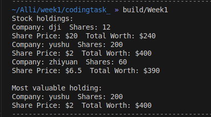

# 第一周算法组作业
## 1.linux命令行使用
1. 切换到~目录，新建一个子目录workspace，然后列出当前目录下的全部文件和子目录
>cd ~
  mkdir workspace
  ls -l 
2. 更新apt软件包指引，并使用apt安装vim
>sudo apt update
  sudo apt install vim 
3. 切换到workspace目录，使用vim（一种终端文本编辑工具）创建一个文件，写入一段话（文件名和内容自拟），保存并退出，然后在不打开vim的情况下查看文件内容
>cd workspace
vim test.txt
cat test.txt
4. 创建一个空文件empty.txt，将该文件和上一步创建的文件一起打包成zip，在workspace目录下新建一个子目录dir，将该文件移动到新建的目录下 
>touch empty.txt
zip archive.zip    test.txt     empty.txt
mkdir dir
mv archive.zip dir
5. 解压这个文件，列出当前目录下的全部文件和子目录，然后返回上一级，删除目录dir
>cd dir
unzip archive.zip
ls -l
cd ..
rm -r dir

## 2.面向对象编程
工程架构：
build/
include/
    stock.hpp
src/
    main.cpp
    stock.cpp
CMakeLists.txt

stock.hpp:
```
#ifndef  STOCK_H_
#define  STOCK_H_

#include <string>

//声明一个类
class Stock

{
    private:
    std::string company;
    long shares;
    double share_val;
    double total_val;
    void set_tot(){total_val=share_val*shares;}

    public:
    Stock();             //构造函数
    Stock(const std::string &co, long n=0,double pr=0.0);
    ~Stock();            //析构函数
    void acquire(const std::string & co ,long n, double pr);     //资产情况
    void buy(long num,double price);                             //购入股票
    void sell(long num,double price);                            //卖出股票
    void update(double price);                                   //更新资产

    //以下两个成员函数被引用，用到this指针，使用const限定
    void show() const;
    const Stock& topval(const Stock& s) const;                   //股票种类中比较出最大值
};


#endif
```
stock.cpp:
```
//类方法的实现源文件
#include <iostream>
#include <stock.hpp>

Stock::Stock()
{
    company ="no name";
    shares=0;
    share_val=0.0;
    total_val=0.0;
}
Stock::Stock(const std::string&co,long n,double pr )
{
    company=co;
    if (n<0)
    {
        std::cout<<"Number of shares can't be negative;"
              << company <<"shares set to 0.\n";
        shares=0;
    }
    else {
            shares=n;
    }
    share_val=pr;
    set_tot();
}

Stock::~Stock()
{

}
void Stock::acquire(const std::string&co,long n,double pr )
{
    company=co;
    if (n<0)
    {
        std::cout<<"Number of shares can't be negative;"
              << company <<"shares set to 0.\n";
        shares=0;
    }
    else {
            shares=n;
    }
    share_val=pr;
    set_tot();
}
void Stock::buy(long num, double price)
{
    if(num<0)
    {
        std::cout<<"Number of shares purchased can't be negative."
                <<"Transaction is aborted.\n";
    }
    else {
    shares+=num;
    share_val=price;
    set_tot();
    }
}
void Stock::sell(long num, double price)
{
    using std::cout;
    if(num<0)
    {
        cout<<"Number of shares can't be negative."
            <<"Transaction is aborted\n";
    }
    else if(num > shares)
    {
        cout<<"You can't sell more than you have!"
            <<"Transaction is aborted .\n";
    }
    else 
    {
        shares-=num;
        share_val=price;
        set_tot();
    }
}
void Stock::update(double price)
{
    share_val=price;
    set_tot();
}

void Stock::show() const
{
    std::cout<<"Company: "<<company
             <<"  Shares: "<<shares<<'\n'
             <<"Share Price: $"<<share_val
             <<"  Total Worth: $"<<total_val<<'\n';
}
const Stock & Stock::topval(const Stock& s) const
{
    if(s.total_val>total_val)
        return s;
    else
        return *this;
}
```

main.cpp
```
//展示自己所持有的科技公司股票并找出最贵的一种
#include <iostream>
#include<stock.hpp>
int main()
{
    Stock stocks[num]={
        Stock("dji",12,20.0),
        Stock("yushu",200,2.0),
        Stock("zhiyuan",60,6.5),
    };
    std::cout<<"Stock holdings:\n";
    int st;
    for(st=0;st<num;st++)
        stocks[st].show();          //遍历展示股票持有情况

    const Stock *top=&stocks[0];
    for(st=1;st<num;st++)
        top=&top->topval(stocks[st]); //遍历选出最高价值的股票类型
    std::cout<<"\nMost valuable holding:\n";
    top->show();
    return 0;
}
```
运行效果如下
