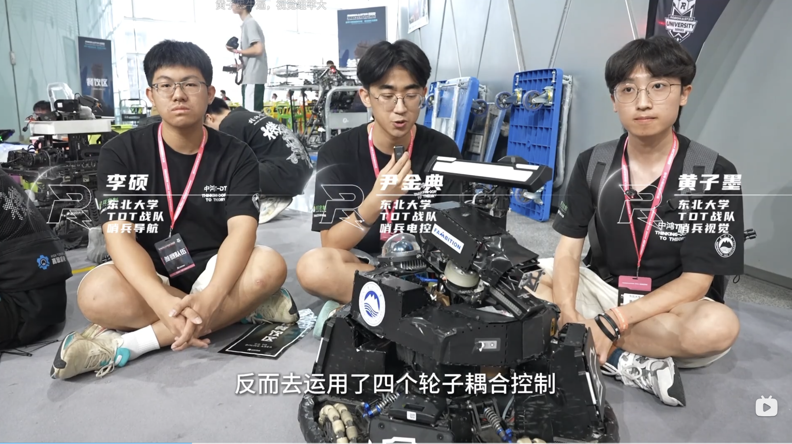
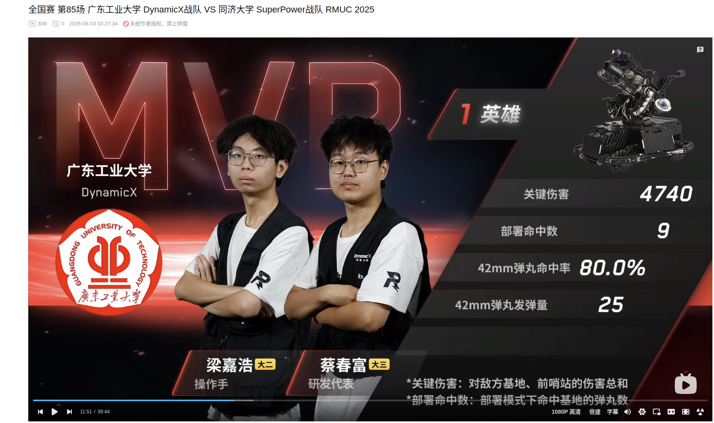
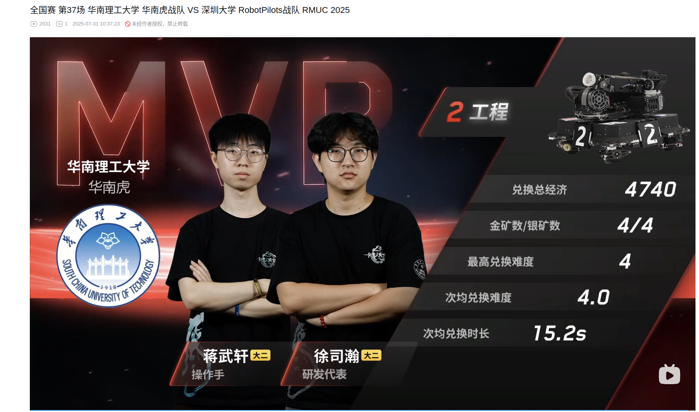

# 通识课 第一周作业
## 1.2.1 任务一
- 关注RoboMaster机甲大师b站、抖音官方账号，以及Alliance b站、抖音官方账号
- 去官方主页找一个你最喜欢的视频（纪录片、技术方案分享甚至招聘岗位介绍都可以）
-  去b站找到三个队伍的官方账号                

[视频链接【机甲大师  第五季（2024）：看点21 造一台全自动机器人需要什么？2】](https://www.bilibili.com/bangumi/play/ep1114564/?share_source=copy_web)

## 1.3.1 任务二
在全国赛中，找出你认为观赏性最高的，或者你最喜欢的一局比赛，并说出原因（控制在300字之内）
第26场南航对广工的第2局。
虽然南航连输了两局输了比赛，但是这一场还是赛出了不拚到最后永不放弃的比赛精神。首先是南航飞镖命中了移动靶（真神）。但可惜的是南航没有抓住地方15秒致盲期打出一波压制性进攻。广工抓准时机压制住了对面，英雄到达舒适的吊射位快速削低南航基地血量追回飞镖造成的血量差。整场比赛可以说双方势均力敌，优势几经易手。双方的英雄都对对面基地造成了客观的打击，也都被对方的步兵针对绞杀。在英雄无法行动的时刻广工凭借地面步兵血量和无人机的优势凭借小弹丸磨到不足100血，而广工还有1800的血量，似乎胜负已分。但是关键时刻南航英雄复活疯狂输出对面基地。对方小弹丸耗尽，基地仅剩9血！而凭借这一线生机英雄倾尽大弹丸将广工打成不到200血。最后广工抢先远程买弹赢得比赛。南航血战至最后一刻的求生欲，广工进攻的果决，都在这场比赛里充分展现。

## 1.3.2 任务三
最高命中率英雄：[【全国赛 第85场 广东工业大学 DynamicX战队 VS 同济大学 SuperPower战队 RMUC 2025】]( https://www.bilibili.com/video/BV1fqhgzdECp/?share_source=copy_web&vd_source=2bd4c4682da67f902a3b96a0a9fe5250)

在本场比赛中，第一轮正面交火前哨站被推掉后，双方回家补给展开第二轮攻势，广工的英雄机器人此时在己方基地公路隧道旁进行吊射。自家的步兵在公路隧道防守使得对方的步兵不能立刻突进且消耗了对方的弹药使得对方击杀己方步兵后无法再斩杀英雄，此场英雄在步兵的保障下抓住了对方步兵没有立刻抓英雄timing，从容的进行部署吊射对方基地。英雄本身的稳定性，步兵的配合，战场时机的把控成就了本场英雄的优异表现。

最高经济工程：[【全国赛 第37场 华南理工大学 华南虎战队 VS 深圳大学 RobotPilots战队 RMUC 2025】]( https://www.bilibili.com/video/BV1fm8kzLErs/?share_source=copy_web&vd_source=2bd4c4682da67f902a3b96a0a9fe5250)

在本场比赛中华南理工稳居上风。深圳大学开局没有呼叫无人机且在之后的对局中无人机未出现（本身就少了一个推掉前哨站的关键力量），而是依靠3号轮腿步兵强冲对面基地配合开场经济可提供的一次买活机会，打算靠两条血条强换英雄，可惜被对方步兵连续斩杀，经济落后且基地少了一个防御力量。而华南理工的无人机快速推掉深大的前哨站，自己的步兵和哨兵完全压制住了对面基地，对面的工程难于兑换经济。而且深大的3号步兵出现了卡坡的失误失去行动能力，一系列的战果使得自己的工程全程不被骚扰可以充分发挥取矿的性能。本场比赛使得工程的优秀性能得到充分体现。

## 1.4.1 任务四

要保证队伍取得更好的成绩就意味着要着重关注如何打好一个高压局，所以对于增益应关注在逆风局或者在小顺风的情况下要关注吃哪一部分的收益。
1.哨兵变为全自动步兵，也就是开局就作为一个超级步兵，在前期有很强的碾压力，所以哨兵应当做好。
2.无人机开局满弹，超出时间范围后仍可以通过金币来买时间，所以无人机和工程应当做好，规则对地形的改动对工程没有颠覆性的影响，还是关注做好如何提高采矿和兑换的效率。如果做好了经济，那么在比赛中推前哨站，在关键时刻拉长无人机作战时间，给对面洗头，给部署状态的英雄洗头，洗对面基地都有优势。
3.保留传统步兵的方案，在精力有余的情况下准备小型化或轮腿步兵方案。跨隧道和飞坡吃到的加成在步兵对打的时候能提供优势，且已有落地的方案参考。
4.重视堡垒增益和能量机关增益，在高压局的情况下，如果被对面压制可以通过堡垒守家，有一点血量差距就可以吃到堡垒增益，（但是防不住对面英雄的吊射？？）能量机关由只对机器人其作用到变为对基地和前哨站都有加成，且能量机关可由任何种类的机器人击打。步兵击打可以使效益最大化，要关注步兵击打能量机关的功能实现。
5.英雄的吊射能力要关注，堡垒的增益使得小优势方的进攻难度增大，但是因为对方多在守家英雄不被干扰，通过英雄吊射基地拉开血量差是影响胜负的重要一环。
6.放弃飞镖射击移动靶的功能（收益很诱人，但是不好拿，实际帮助不如去做好击打固定靶的功能）
